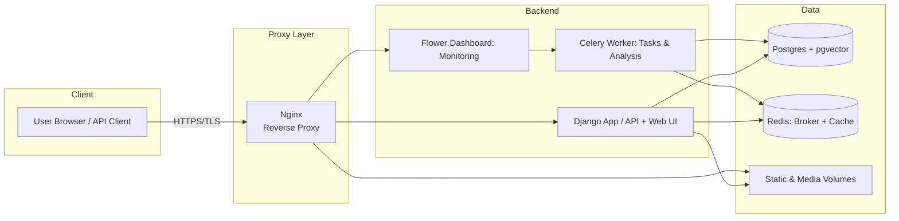

# 📘 EpiVar Database – Documentation

EpiVar is a database for **epigenomic variation studies**, supporting submission, validation, integration, and analysis of association, interaction, and profiling data.  
It provides standardized submission formats, ontology-based metadata, and built-in analysis modules for downstream interpretation.

---

## Data Submission Format

All submitted datasets must be provided in **tab-delimited BED/BEDPE-like, bgzipped files** with the following schema depending on study type.  
**Importantly** Genomic positions should follow 0-based notation and chromosome names have to match - `1–22, "X", "Y", "MT"` values.

---

### Study Types

- **AssociationStudy** – associations between epigenomic marks and phenotypes  
- **InteractionStudy** – interactions between two genomic regions (e.g., meQTL, chromatin loops)  
- **ProfilingStudy** – genome-wide reference profiling data  


### 1. Association Record (Association Studies)

Describes associations between an **epigenomic mark** and a **phenotype**.

| Column    | Type                                   | Description                |
|-----------|----------------------------------------|----------------------------|
| `#chrom`  | `CHR_OPTIONS_STR \| CHR_OPTIONS_MIXED` | Chromosome identifier      |
| `start`   | `int ≥ 0`                              | Interval start (0-based)   |
| `end`     | `int ≥ 0`                              | Interval end               |
| `name`    | `str`                                  | Locus/gene/feature name    |
| `score`   | `"."`                                  | Placeholder                |
| `strand`  | `"+" / "-" / "."`                      | Strand orientation         |
| `es`      | `float`                                | Effect size metric         |
| `p-value` | `float <0,1>`                          | Statistical significance   |

**Expected column order:**  #chrom, start, end, name, score, strand, es, p-value


---

### 2. Profiling Record (Profiling Studies)

Captures **genome-wide reference values** for specific samples.

| Column    | Type                                  | Description                |
|-----------|---------------------------------------|----------------------------|
| `#chrom`  | `CHR_OPTIONS_STR \| CHR_OPTIONS_MIXED`| Chromosome                 |
| `start`   | `int ≥ 0`                             | Interval start             |
| `end`     | `int ≥ 0`                             | Interval end               |
| `name`    | `Optional[str]`                       | Feature label              |
| `score`   | `"."`                                 | Placeholder                |
| `strand`  | `"+" / "-" / "."`                     | Strand orientation         |
| `me`      | `float ≥ 0`                           | Measurement (e.g., methylation level) |

**Expected column order:**  #chrom, start, end, name, score, strand, me


---

### 3. Interaction Record (Interaction Studies)

Represents **interactions between genomic intervals**, e.g., meQTLs.

| Column    | Type                                  | Description                |
|-----------|---------------------------------------|----------------------------|
| `#chrom1` | `CHR_OPTIONS_STR \| CHR_OPTIONS_MIXED`| Chromosome 1               |
| `start1`  | `int ≥ 0`                             | Interval 1 start           |
| `end1`    | `int ≥ 0`                             | Interval 1 end             |
| `chrom2`  | `str`                                 | Chromosome 2               |
| `start2`  | `int ≥ 0`                             | Interval 2 start           |
| `end2`    | `int ≥ 0`                             | Interval 2 end             |
| `name`    | `Optional[str]`                       | Feature name               |
| `score`   | `"."`                                 | Placeholder                |
| `strand1` | `"+" / "-" / "."`                     | Strand orientation (interval 1) |
| `strand2` | `"+" / "-" / "."`                     | Strand orientation (interval 2) |
| `es`      | `float [0,1]`                         | Effect size                |
| `p-value` | `float [0,1]`                         | Statistical significance   |

**Expected column order:**  #chrom1, start1, end1, chrom2, start2, end2, name, score, strand1, strand2, es, p-value

---

## 📖 Ontologies

EpiVar uses **ontology terms** to describe studies and metadata, ensuring interoperability. Right now all terms are synchronized with
**EBI OLS4 API**.

---

## 🔬 Analysis Modules

EpiVar supports **three built-in analysis workflows**:

### 1. GSEA (Gene Set Enrichment Analysis)

- Input: genomic intervals (BED) or gene lists  
- Test: **Hypergeometric test**  
- Options:
  - Reference genome selection  
  - Foreground vs background set  
  - Strandness constraints  
  - Multiple testing corrections  

---

### 2. LOA (Locus Overlap Analysis)

- Compares **foreground vs background overlaps**  
- Tests:
  - **Fisher’s exact test**  
- Options:
  - Universe definition (≤ 5 genomic tracks)  
  - Minimum overlap threshold  
  - Alternative hypothesis selection
  - Multiple testing correction

---

### 3. SOA (Study Overlap Analysis)

- Compares submitted dataset against **EpiVar repository studies**:
  - Association studies  
  - Interaction studies  
  - Profiling studies  
- Significance based on p-value threshold (only for association/interaction).  

---


## 🚀 Running EpiVar

EpiVar is fully containerized using **Docker Compose**.  
The stack consists of:

- **App** – Django application (API + web interface)  
- **Celery Worker** – background task processor for data integration and analysis  
- **Redis** – message broker and cache backend  
- **Postgres (pgvector)** – primary database with vector support for embeddings  
- **Flower** – monitoring dashboard for Celery tasks  
- **Nginx** – reverse proxy, static/media file serving, and TLS termination  

---

## System Architecture



## 1. Prerequisites

- [Docker](https://docs.docker.com/get-docker/) ≥ 20.10  
- [Docker Compose](https://docs.docker.com/compose/) ≥ v2  
- Git (to clone the repository)

---

## 2. Environment Configuration (`.env`)

The application requires a `.env` file. nBelow is a list of all supported environment variables and their purpose.

| Variable | Description |
|----------|-------------|
| **Django Settings** ||
| `DEBUG` | Run Django in debug mode (`True` for development, `False` for production). |
| `SECRET_KEY` | Secret key for Django (must be a long random string). |
| `ALLOWED_HOSTS` | Comma-separated list of allowed hostnames or IPs. |
| `CSRF_TRUSTED_ORIGINS` | Trusted origins for CSRF protection (comma-separated URLs). |
| `DJANGO_SUPERUSER_USERNAME` | Username for the Django superuser (created on first run). |
| `DJANGO_SUPERUSER_EMAIL` | Email address for the Django superuser. |
| `DJANGO_SUPERUSER_PASSWORD` | Password for the Django superuser. |
| **Database (Postgres)** ||
| `DB_NAME` | Name of the PostgreSQL database. |
| `DB_USER` | Username for the PostgreSQL connection. |
| `DB_PASS` | Password for the PostgreSQL connection. |
| `DB_HOST` | Hostname of the PostgreSQL server (e.g., `db`). |
| `DB_PORT` | Port number of the PostgreSQL server (default: `5432`). |
| **Redis (for Celery + Cache)** ||
| `REDIS_HOST` | Hostname of the Redis server (e.g., `redis`). |
| `REDIS_PORT` | Port number of the Redis server (default: `6379`). |
| `REDIS_PASS` | Password for the Redis instance. |
| `MPLCONFIGDIR` | Directory path for Matplotlib configuration (used by some analysis modules). |
| **Celery Config** ||
| `TZ` | Time zone used by Celery (e.g., `UTC`). |
| **Flower (Celery Monitoring Dashboard)** ||
| `FLOWER_USER` | Username for Flower dashboard authentication. |
| `FLOWER_PASS` | Password for Flower dashboard authentication. |
| `FLOWER_PORT` | Port for Flower dashboard (default: `5555`). |
| `FLOWER_ENDPOINT` | URL prefix under which Flower will be served. |
| **Field Encryption** ||
| `FIELD_ENCRYPTION_KEY` | A **32-byte url-safe base64 string** used to encrypt sensitive fields. |
| **Import Config** ||
| `GENE_SETS_DIR` | Path to directory containing gene set collections. |
| **Sentence Transformer** ||
| `HF_HOME` | Path to HuggingFace cache directory for transformer models. |

---

## 3. Build & Start Services
```bash
docker compose build
docker compose up -d
```
